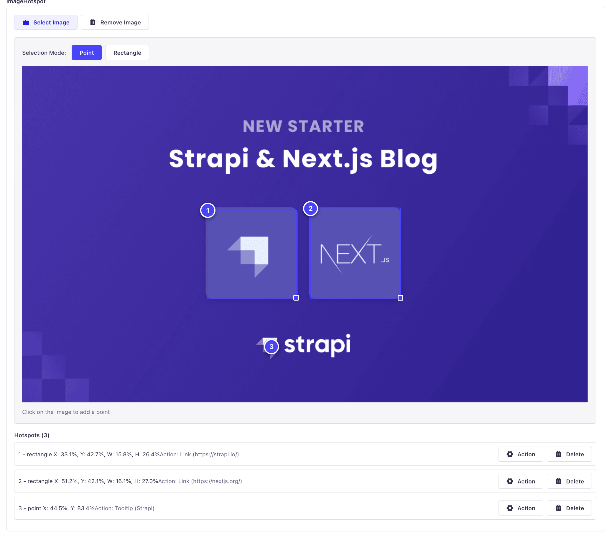
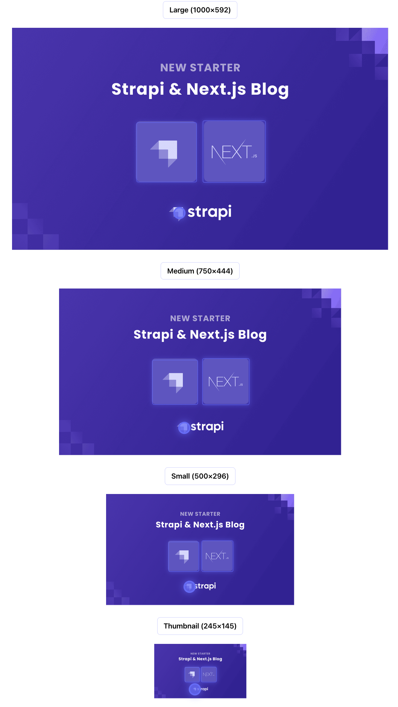
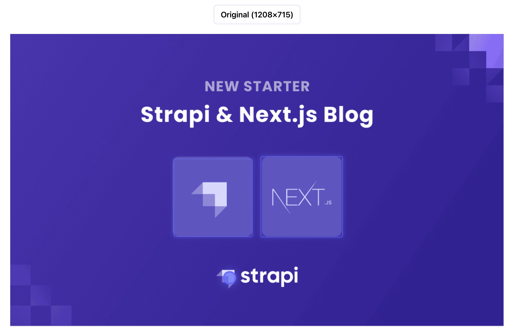

# Building Interactive Image Hotspots: A Strapi v5 Custom Field Plugin

**Title:** Building Interactive Image Hotspots: A Strapi v5 Custom Field Plugin

**Author:** Maksim Zhukau

## Introduction

Interactive images with clickable hotspots have become a powerful tool for creating engaging user experiences. Whether you're building an e-commerce site where users can click on product features, a travel guide with clickable landmarks, or an educational platform with interactive diagrams, image hotspots provide an intuitive way to add rich interactivity to static images.

In this article, I'll share my journey of creating the **Image Hotspot Plugin** for Strapi v5—a custom field plugin that allows content editors to add interactive hotspots to images directly within the Strapi admin panel. I'll walk you through the development process, explain how it works under the hood, and show you how to use it in your projects.

## About This Plugin

The Image Hotspot Plugin is a Strapi v5 custom field that enables content editors to:

- **Select images** from the Strapi media library
- **Add point hotspots** by clicking on specific areas of the image
- **Add rectangle hotspots** by clicking and dragging to define regions
- **Configure actions** for each hotspot, including:
  - **Link actions**: Navigate to URLs (same tab or new tab)
  - **Modal actions**: Display content in modal dialogs
  - **Tooltip actions**: Show tooltips on hover
  - **Callback actions**: Execute custom JavaScript functions
  - **Custom actions**: Define flexible actions with custom payloads
- **Manage hotspots**: Drag, resize, and delete hotspots with visual feedback
- **Automatic image population**: Server-side middleware automatically populates image fields in API responses

The plugin stores hotspot data as JSON, making it easy to consume in any frontend framework. The server-side middleware ensures that when you fetch content via the API, the image field is automatically populated with the full media object (including URL, alternative text, etc.), not just an ID.



## Why I Built It

I worked on a project requiring interactive product images, where users could click on different parts to learn about specific features. I searched for existing solutions but couldn't find any suitable ones.

I realized that Strapi v5's custom field API provided the perfect opportunity to build a native solution. The plugin would:

- Provide a visual, intuitive interface for content editors
- Store data in a structured format that's easy to consume
- Integrate seamlessly with Strapi's media library
- Support multiple action types for maximum flexibility
- Automatically handle image population on the server side

## How It Works Under the Hood

### Architecture Overview

The plugin consists of two main parts:

1. **Admin Panel Component** (React/TypeScript): The visual editor for creating and managing hotspots
2. **Server-Side Middleware** (Node.js/TypeScript): Automatically populates image fields in API responses

### Custom Field Registration

The plugin registers a custom field of type `json` that stores the hotspot data:

```typescript
// server/src/register.ts
strapi.customFields.register({
  name: "image-hotspot",
  plugin: "image-hotspot",
  type: "json",
  inputSize: {
    default: 12,
    isResizable: true,
  },
});
```

```typescript
// admin/src/index.ts
app.customFields.register({
  name: "image-hotspot",
  pluginId: "image-hotspot",
  type: "json",
  intlLabel: {
    id: "image-hotspot.label",
    defaultMessage: "Image Hotspot",
  },
  components: {
    Input: async () => import("./components"),
  },
});
```

### Data Structure

The plugin stores data in the following structure:

```typescript
interface ImageHotspotValue {
  image: string; // Media documentId
  hotspots?: Hotspot[];
}

interface Hotspot {
  id: string;
  type: "point" | "rectangle";
  x: number; // percentage (0-100)
  y: number; // percentage (0-100)
  width?: number; // percentage (0-100) - only for rectangle
  height?: number; // percentage (0-100) - only for rectangle
  label?: string;
  action?: HotspotAction;
}
```

### Admin Panel Implementation

The main component (`admin/src/components/index.tsx`) orchestrates the hotspot editing experience:

1. **Image Selection**: Uses Strapi's media library modal to select images
2. **Hotspot Creation**: Handles mouse events to create point or rectangle hotspots
3. **Hotspot Management**: Provides drag, resize, and delete functionality
4. **Action Configuration**: Allows editors to configure actions for each hotspot

Key features of the implementation:

- **Coordinate Calculation**: Converts pixel coordinates to percentages for responsive positioning
- **Rectangle Drawing**: Tracks mouse movements during drag to create rectangle hotspots
- **Visual Feedback**: Shows selected hotspots and provides drag handles for rectangles
- **State Management**: Uses custom hooks to manage hotspot state and operations

Here's a simplified version of the coordinate calculation:

```typescript
// admin/src/utils.ts
export function getPercentageCoordinates(
  clientX: number,
  clientY: number,
  imageElement: HTMLImageElement,
): { x: number; y: number } {
  const rect = imageElement.getBoundingClientRect();
  const x = ((clientX - rect.left) / rect.width) * 100;
  const y = ((clientY - rect.top) / rect.height) * 100;
  return {
    x: Math.max(0, Math.min(100, x)),
    y: Math.max(0, Math.min(100, y)),
  };
}
```

### Server-Side Image Population

One of the plugin's key features is automatic image population. The server-side middleware intercepts API responses and automatically populates image references with full media objects:

```typescript
// server/src/bootstrap.ts
strapi.server.use(async (ctx, next) => {
  if (!ctx.path?.startsWith("/api")) {
    return next();
  }

  await next();

  const imageHotspotService = strapi
    .plugin("image-hotspot")
    .service("image-hotspot");

  const contentTypeUid = imageHotspotService.getContentTypeUid(ctx);

  if (contentTypeUid) {
    ctx.body = await imageHotspotService.processResponseBody(
      ctx.body,
      contentTypeUid,
    );
  }
});
```

The service:

1. **Identifies content types** that use the image-hotspot field
2. **Extracts image IDs** from the hotspot data
3. **Fetches media objects** from Strapi's document service
4. **Replaces IDs with full objects** in the response

This means when you fetch content via the API, you get:

```json
{
  "data": {
    "imageHotspot": {
      "image": {
        "id": 1,
        "url": "/uploads/image.jpg",
        "alternativeText": "Product image",
        "width": 1200,
        "height": 800,
        "formats": {...}
      },
      "hotspots": [...]
    }
  }
}
```

Instead of just:

```json
{
  "data": {
    "imageHotspot": {
      "image": "abc123",
      "hotspots": [...]
    }
  }
}
```

### Action Types

The plugin supports multiple action types, each with its own configuration:

#### Link Action

```json
{
  "type": "link",
  "url": "https://example.com",
  "target": "_blank"
}
```

#### Modal Action

```json
{
  "type": "modal",
  "modalTitle": "Product Details",
  "modalContent": "This product features..."
}
```

#### Tooltip Action

```json
{
  "type": "tooltip",
  "tooltipText": "Click to learn more"
}
```

#### Callback Action

```json
{
  "type": "callback",
  "callbackName": "handleHotspotClick",
  "callbackParams": {
    "hotspotId": "123",
    "action": "navigate"
  }
}
```

#### Custom Action

```json
{
  "type": "custom",
  "customName": "product-detail",
  "customPayload": {
    "productId": "123",
    "variant": "blue"
  }
}
```

## Usage Example

### Adding to a Content Type

In your content type schema:

```json
{
  "attributes": {
    "productImage": {
      "type": "customField",
      "customField": "plugin::image-hotspot::image-hotspot"
    }
  }
}
```

### Frontend Implementation

Here's a React example for rendering hotspots:





```tsx
function HotspotImage({ data }: { data: ImageHotspotValue }) {
  const handleHotspotClick = (hotspot: Hotspot) => {
    if (!hotspot.action) return;

    switch (hotspot.action.type) {
      case "link":
        window.open(hotspot.action.url, hotspot.action.target || "_self");
        break;
      case "modal":
        // Show modal
        break;
      case "tooltip":
        // Show tooltip
        break;
      case "callback":
        if (window[hotspot.action.callbackName]) {
          window[hotspot.action.callbackName](hotspot.action.callbackParams);
        }
        break;
      case "custom":
        // Handle custom action
        break;
    }
  };

  return (
    <div className="hotspot-container" style={{ position: "relative" }}>
      
      {data.hotspots?.map((hotspot) => (
        <div
          key={hotspot.id}
          style={{
            position: "absolute",
            left: `${hotspot.x}%`,
            top: `${hotspot.y}%`,
            width: hotspot.width ? `${hotspot.width}%` : "20px",
            height: hotspot.height ? `${hotspot.height}%` : "20px",
            cursor: "pointer",
            border: "2px solid #007bff",
            borderRadius: hotspot.type === "point" ? "50%" : "4px",
          }}
          onClick={() => handleHotspotClick(hotspot)}
        >
          {hotspot.label}
        </div>
      ))}
    </div>
  );
}
```

## What's Next (Roadmap)

The Image Hotspot Plugin is actively maintained and has several planned improvements:

1. **Relation Actions**: Add support for linking hotspots to Strapi content types (e.g., link to a product, article, etc.)
2. **Bulk Operations**: Add, delete, or modify multiple hotspots at once
3. **Export/Import**: Export hotspot configurations for reuse across content types
4. **Advanced Styling**: Customizable hotspot appearance (colors, icons, animations)

## How to Contribute / Call to Action

The Image Hotspot Plugin is open source and available on GitHub. Contributions are welcome!

**Repository**: [github.com/MaksZhukov/strapi-plugin-image-hotspot](https://github.com/MaksZhukov/strapi-plugin-image-hotspot)

**Ways to contribute:**

1. **Report Issues**: Found a bug or have a feature request? Open an issue on GitHub
2. **Submit Pull Requests**: Have an improvement? Submit a PR!
3. **Share Use Cases**: Tell us how you're using the plugin—we'd love to hear about it
4. **Improve Documentation**: Help make the plugin more accessible to others

**Installation:**

The plugin can be installed directly from npm or by cloning the repository into your Strapi project's `src/plugins` directory.

```bash
# If published to npm
npm install strapi-plugin-image-hotspot

# Or clone into src/plugins
git clone https://github.com/MaksZhukov/strapi-plugin-image-hotspot.git src/plugins/image-hotspot
```

## Conclusion

Building a custom field plugin for Strapi v5 was a rewarding experience that combined frontend React development with server-side Node.js middleware. The plugin demonstrates how Strapi's extensible architecture allows developers to create powerful, integrated solutions that enhance the content management experience.

Whether you're building an e-commerce platform, an educational website, or any application that benefits from interactive images, the Image Hotspot Plugin provides a flexible, easy-to-use solution that integrates seamlessly with Strapi.

If you're interested in creating your own Strapi plugin, I encourage you to explore the [Strapi Plugin Development documentation](https://docs.strapi.io/dev-docs/plugins) and start building. The plugin ecosystem is growing, and there's always room for innovative solutions that make content management easier and more powerful.
